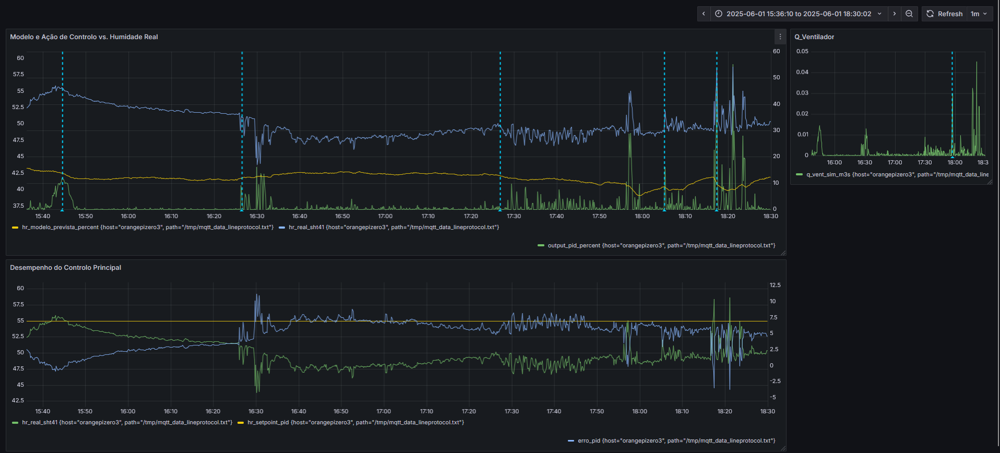
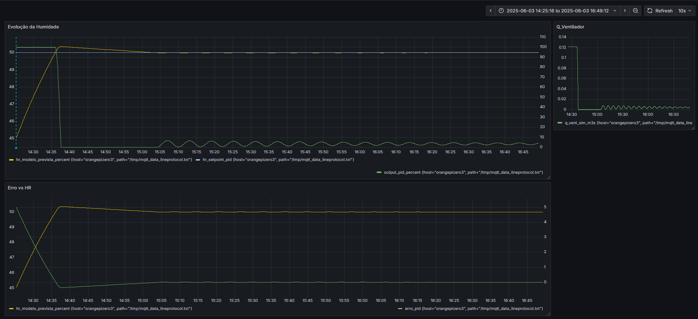

# Sistema Inteligente de Controlo de Qualidade do Ar Interior (IAQ)

## Da Monitorização Passiva ao Controlo Ativo
Uma das poucas lições positivas que a pandemia de Covid-19 nos deixou foi a perceção de que existem riscos invisíveis à nossa saúde dentro dos espaços fechados. Muitos poluentes e substâncias contaminantes estão presentes nos ambientes interiores sem que os nossos sentidos – como o olfato, o paladar ou a visão – nos possam alertar para o perigo.

É aqui que entram os monitores de qualidade do ar interior (IAQ). Estes dispositivos detetam a presença de poluentes e fornecem dados objetivos sobre os níveis de contaminação, permitindo-nos agir antes que se tornem um risco real. Quanto mais informação tivermos, mais conscientes e eficazes serão as nossas decisões para manter um ambiente saudável e seguro nas nossas casas.

Inicialmente, o objetivo era apenas visualizar os dados de qualidade do ar. No entanto, depois de uma UC de Controlo Digital, o objetivo final do projeto tornou-se criar um sistema que não só monitoriza, mas que age autonomamente para corrigir as condições ambientais, transformando um monitor passivo num controlador ativo e inteligente.

### Parâmetros Mais Importantes em IAQ

Há vários parâmetros que convém medir, mas os principais são:

#### **Temperatura e Humidade**  
Conhecer os valores de temperatura e humidade de um espaço ajuda a
identificar condições que favorecem o crescimento de bactérias e bolor.
Ambientes muito húmidos aumentam esse risco. Alguns dispositivos também calculam o ponto de orvalho – a temperatura na qual o ar já não consegue reter mais vapor de água, levando à condensação.

#### **CO2 (Dióxido de Carbono)**  
O CO2 é um composto químico que os humanos libertam ao respirar. Níveis elevados podem causar fadiga, falta de concentração e redução da produtividade. Monitorizar os níveis de CO2 permite avaliar a qualidade da ventilação de um espaço e saber quando é necessário arejar.

#### **Particulate Matter (PM)**  
As partículas em suspensão (PM) são uma mistura de partículas sólidas e líquidas tão pequenas que podem ser inaladas, afetando a saúde respiratória. São originadas por poeira, fumo, poluição, entre outros.  

- **PM10** – Partículas com diâmetro inferior a 10 micrómetros.  
- **PM2.5** – Partículas com diâmetro inferior a 2.5 micrómetros, consideradas as mais perigosas para a saúde.  

Para comparação, um fio de cabelo humano tem aproximadamente 70 micrómetros de diâmetro.


## Construção do Sistema de Monitorização

### Hardware  

- **ESP32C6** - Dispositivo central responsável pela recolha e transmissão de dados via **WiFi 6** e **Bluetooth 5**, garantindo uma comunicação eficiente com os sensores.  

- **SHT41** - Sensor de **temperatura e humidade** com maior precisão do que os comuns **DHT11** e **DHT22**. Comunica via **I2C** e permite medições de temperatura entre **-40°C e 125°C** e de humidade entre **0% e 100%**.  

- **Senseair S8** – Sensor de **CO₂** do tipo **NDIR (Non-Dispersive Infrared)**. Mede concentrações entre **400 e 5000 ppm**, com uma precisão de **±40 ppm + 3% da leitura**, comunicando via **UART**.  

    Possui um sistema de **ABC (Automatic Baseline Correction)** ativo por padrão, que torna o sensor praticamente **livre de manutenção** em ambientes normais. Este algoritmo realiza uma **correção automática de deriva** ao longo do tempo, assumindo que o sensor será exposto periodicamente a ar fresco com uma concentração de **400 ppm de CO₂**.  

    O ciclo padrão de correção ocorre a cada **15 dias** de operação contínua, é aconselhado deixar o sensor ativo por pelo menos **25 dias** para garantir que estou a receber medições precisas.

- **Plantower PMS2.5** - Sensor de **partículas em suspensão (PM)**, capaz de medir **PM1.0, PM2.5 e PM10**. Permite identificar partículas com diâmetros mínimos de **0.3 µm**, sendo útil para monitorizar poeira, fumo e poluição urbana. Comunica via **UART**.  

- **Panasonic SN-GCJA5** – Sensor de partículas **Laser-based** de alta precisão, usado para medir **PM1.0**, **PM2.5** e **PM10** (Particulate Matter). Baseia-se no **princípio de dispersão de luz** (light scattering) usando um **laser interno** e um fotodiodo sensível para detetar partículas suspensas no ar.  

    Possui uma **ventoinha interna** que garante fluxo de ar constante através da câmara de medição, o que melhora a fiabilidade das leituras. A comunicação é feita via **UART** ou **I2C**.  

    O sensor tem uma elevada sensibilidade, sendo capaz de detetar partículas com diâmetros **inferiores a 1 µm**. As leituras são fornecidas em **μg/m³**. 

### Implementação  

Para não seguir o caminho tradicional com **Arduino IDE** e experimentar algo novo, decidi utilizar **ESP IDF**. É uma opção mais flexível, permitindo testar rapidamente os sensores sem complicação.  

??? note "👉 Clique aqui para ver o guia técnico detalhado de configuração do ambiente"
    #### **Configurar o ESP32-C6**  

    O ESP32-C6 vem sem **ESP IDF** instalado, então é necessário **flashar o firmware** antes de começar.  

    **1. Instalar o esptool**  
    Antes de tudo, precisamos do **esptool**, que serve para interagir com microcontroladores ESP. Como já tenho **Python** instalado, basta abrir o **cmd** e executar:  
    ```
    pip install esptool
    ```

    **2. Ligar o ESP32-C6 ao PC**  
    A parte mais complicada... conectar o ESP32-C6 ao PC usando um **cabo USB-C para USB-A** 😆.  

    **3. Instalar os drivers USB to UART**  
    Para que o ESP32-C6 seja reconhecido corretamente, precisamos dos **USB to UART Bridge VCP Drivers**.  

    - O download pode ser feito diretamente em [Silicon Labs](https://www.silabs.com/developer-tools/usb-to-uart-bridge-vcp-drivers?tab=downloads).  
    - Após o download, extrair os ficheiros e localizar **`silabser.inf`**.  
    - Clicar com o **botão direito** e selecionar **Instalar**.  

    Agora, no **Device Manager**, o dispositivo deve aparecer como **Silicon Labs CP210x USB to UART Bridge (COMx)**.  
    Tomar nota do número da porta COM atribuída (no meu caso, **COM3**).  

    **4. Limpar a flash do ESP32-C6**  
    Antes de instalar o firmware, convém limpar a memória do ESP para evitar problemas. No terminal, correr:  ``python -m esptool --port COM3 erase_flash``

    Se tudo correr bem, deve aparecer a mensagem: **Chip erase completed successfully**.

    **5. Instalar o ESP-IDF**  
    Podemos fazer download da versão mais recente para **Windows** do [**ESP-IDF**](https://idf.espressif.com/) para o ESP32-C6 neste [link](https://docs.espressif.com/projects/esp-idf/en/stable/esp32c6/get-started/windows-setup.html).  

    Durante o processo de instalação, selecionei a opção de criar **atalhos no ambiente de trabalho**, facilitando o acesso ao **ESP-IDF Command Prompt** e ao **IDE**.  

    **6. Testar com Hello World**  
    Depois de instalado, podemos verificar se tudo está a funcionar corretamente com um pequeno teste:  

    - Abir o ESP-IDF CMD e navegar até ao exemplo já incluído de **Hello World**:  
    ``
    cd %IDF_PATH%\examples\get-started\hello_world
    ``
    - Definir o **target** para a nossa board ESP32-C6:  
    ``
    idf.py set-target esp32c6
    ``
    - Fazer **build** do firmware:  
    ``
    idf.py build
    ``
    - Flashar o firmware para a board:  
    ``
    idf.py -p COM3 flash
    ``
    - Confirmar que está a imprimir **Hello World**, visualizando o output do **serial monitor**:  
    ``
    idf.py -p COM3 monitor
    ``
    ---
    #### **Ligações**
    

    Como referência para as ligações, utilizo esta imagem da **board** que estou a usar:  
      

    Conforme mencionado na secção de **hardware**, os sensores comunicam da seguinte forma:  
    - **Senseair S8** e **Plantower PMS2.5** → UART  
    - **SHT41** → I2C  

    ---

    #### **Pipeline de Dados**  

    Para armazenar e visualizar os dados dos sensores, utilizei o **InfluxDB**, o **Mosquitto MQTT Broker** e o **Telegraf** para integrar os serviços.  

    **1. Instalar e configurar o InfluxDB**  

    1. Fazer **download** da versão mais recente do **InfluxDB v2** no [site oficial](https://www.influxdata.com/).  
    2. Abrir o **PowerShell** em modo **Administrador** e navegar até a pasta de **Downloads**.  
    3. Executar o seguinte comando para extrair os ficheiros:  
    ```
    Expand-Archive .\influxdb2-2.7.11-windows.zip -DestinationPath 'C:\Program Files\InfluxData'
    ```
    4. Clicar com o **botão direito** no **.exe**, copiar o **caminho completo** e abrir o **CMD**.  
    5. Colar o **caminho** copiado e pressionar **Enter**.  

    O **WebUI** do **InfluxDB** deve abrir em `http://localhost:8086`.  
    Criar uma conta e seguir as instruções iniciais.  

    ---

    **2. Instalar e configurar o Mosquitto MQTT Broker**  

    1. Fazer **download** do **Mosquitto** no [site oficial](https://mosquitto.org/download/).  
    2. Após a instalação, abrir o **CMD**, navegar até a pasta de instalação e iniciar o serviço com:  ``mosquitto``


    **Testar a comunicação MQTT**  
    Abrir dois **CMDs**:  

    - **CMD 1** (para subscrever a um tópico):  
    ```
    "C:\Program Files\mosquitto\mosquitto_sub.exe" -h 127.0.0.1 -t test/topic
    ```

    - **CMD 2** (para publicar uma mensagem no tópico):  
    ```
    "C:\Program Files\mosquitto\mosquitto_pub.exe" -h 127.0.0.1 -t test/topic -m "Hello from Mosquitto"
    ```

    Se a mensagem **"Hello from Mosquitto"** aparecer no primeiro terminal, a comunicação MQTT está a funcionar corretamente.  

    Agora, precisamos de conectar o **Mosquitto** ao **InfluxDB** através do **Telegraf** e do **MQTT Consumer**.  

    ---

    **3. Instalar e configurar o Telegraf**  

    1. Fazer **download** do **Telegraf** no [site oficial](https://www.influxdata.com/time-series-platform/telegraf/).  
    2. No **PowerShell** (modo Administrador), executar:  
    ```
    wget https://dl.influxdata.com/telegraf/releases/telegraf-1.34.0_windows_amd64.zip -UseBasicParsing -OutFile telegraf-1.34.0_windows_amd64.zip
    ```
    3. Após o **download**, extrair os ficheiros:  
    ```
    Expand-Archive .\telegraf-1.34.0_windows_amd64.zip -DestinationPath 'C:\Program Files\InfluxData\telegraf'
    ```

    ---

    **4. Configurar o Telegraf para consumir MQTT**  

    1. No **WebUI** do InfluxDB, criar um **Telegraf Configuration File**:  
    - Escolher o **bucket Sensores**.  
    - Selecionar o **plugin MQTT Consumer** na **Plugin Library**.  
    - Adicionar os seguintes **inputs**:  
    ```
    [[inputs.mqtt_consumer]] servers = ["tcp://127.0.0.1:1883"] topics = [ "sensores/sht41/temperature", "sensores/sht41/humidity", "sensores/gcja5/pm1", "sensores/gcja5/pm2.5", "sensores/gcja5/pm10", "sensores/sensair_s8/co2" ] data_format = "influx"
    ```

    2. Adicionar o **Token de Autenticação** conforme indicado no WebUI.  

    ---

    **5. Testar a configuração**  

    Abrir dois **CMDs**:  

    - **CMD 1** (para monitorizar os dados recebidos pelo Telegraf):  
    ```
    telegraf --config http://localhost:8086/api/v2/telegrafs/0e96aec27fc2a000 --debug
    ```

    - **CMD 2** (para enviar dados de teste via Mosquitto):  
    ````
    mosquitto_pub -h 127.0.0.1 -t sensores/sht41/temperature -m "temperature,location=office value=25.3"
    ````

    Se tudo estiver configurado corretamente, o terminal deve exibir a mensagem de sucesso:  

    **[outputs.influxdb_v2] Wrote batch of 1 metrics in 5.0302ms**

    ---

    **6. Visualizar os dados no InfluxDB**  

    1. Aceder ao **WebUI** do **InfluxDB**.  
    2. Ir a **Data Explorer** e abrir o **Script Editor**.  
    3. Executar a seguinte **query** para visualizar os dados:  
    ````
    from(bucket: "Sensores") |> range(start: -1h) |> filter(fn: (r) => r._measurement == "temperature" or r._measurement == "humidity")
    ````

    Os valores dos sensores aparecem no gráfico como desejado.


## Desenvolvimento e  Simulação de um Controlador PID

Para dar inteligência ao sistema, foi desenvolvido um controlador Proporcional-Integral-Derivativo (PID) no ESP32. Antes de o aplicar a um atuador físico, a sua performance foi validada rigorosamente através de uma metodologia de simulação em duas fases.

### Análise em Malha Aberta (Estímulo Real)

Primeiramente, para validar a reatividade do controlador, o sistema operou em **malha aberta**. Nesta configuração, o PID recebia a **humidade medida pelo sensor (SHT41)** como input. A sua saída, no entanto, controlava um atuador simulado e não influenciava o ambiente físico. O objetivo era confirmar que o algoritmo conseguia detetar corretamente o erro em relação ao setpoint e gerar uma ação de controlo proporcional e imediata, como se pode observar na resposta do sistema a perturbações reais. 

### Análise em Malha Fechada (Simulação Pura)

Posteriormente, o sistema foi testado numa configuração de **malha fechada pura**. Aqui, o controlador foi completamente isolado do ambiente real: o seu input de erro era calculado com base na **saída do modelo matemático de humidade (`hr_modelo`)** do ciclo anterior. Esta abordagem "controlador + modelo" permitiu a **sintonia fina dos ganhos do PID (Kp, Ki, Kd)** e a análise detalhada da sua performance (tempo de resposta, overshoot e estabilidade) de forma isolada e repetível.

Esta validação em duas etapas provou que o algoritmo cumpre o objetivo então decidi avançar para a fase de implementação com um atuador real. Todo o trabalho de desenvolvimento e análise foi documentado em detalhe.

> **O relatório elaborado pode ser consultado aqui:**
> **[➡️ Relatório de Análise do Controlador PID (PDF)](https://joaopef.github.io/theSTART/docs/assets/pdf/Relatorio_PID.pdf)**
>
> **O código-fonte completo da simulação está disponível no GitHub:**
> **[➡️ Ver o Código no GitHub</big>](https://github.com/joaopef/esp32-PID)**


## A Implementação Real - Controlo de um Ar Condicionado via Wi-Fi

O próximo passo lógico é aplicar o controlador PID a um **atuador real**. A escolha recaiu sobre o controlo de um ar condicionado **Gree** (Modelo GWH09AGA-K6DNA1A) que possuo no quarto. Em vez de usar um emissor de IR, a abordagem escolhida foi a **comunicação via Wi-Fi**, aproveitando bibliotecas existentes como a **Gree-Esp**. Esta abordagem é bastante superior pois permite um **controlo bidirecional**, onde o sistema pode não só enviar comandos, mas também verificar o estado atual do AC.
### Estratégia de Controlo PID Avançada

Inicialmente a ideia era usar uma estratégia de PWM de ciclo lento (ligar/desligar o AC). No entanto, esta abordagem é ineficiente e potencialmente prejudicial para compressores de ar condicionado modernos do tipo Inverter, que são desenhados para modular a sua velocidade e não para ciclos frequentes de ON/OFF.

Por isso, a solução desenvolvida é uma **estratégia de controlo multi-nível** que traduz a saída do PID (0-100%) em diferentes "níveis de agressão", respeitando as limitações do hardware e otimizando a eficiência:

1. **Ação Suave** (Saída PID 1-40%): O AC é ativado no modo Dry (desumidificação) com a ventoinha em velocidade baixa. Ideal para correções pequenas e manutenção contínua da humidade.

2. **Ação Rápida** (Saída PID 41-80%): A velocidade da ventoinha é aumentada para High no modo Dry, processando um maior volume de ar para correções mais significativas.

3. **Ação Máxima** (Saída PID 81-100%): Para combater grandes e súbitas subidas de humidade, o sistema ativa o modo Cool (arrefecer) com uma temperatura alvo baixa (ex: 18°C) e a ventoinha em Turbo. Isto força o compressor à sua máxima capacidade, resultando na desumidificação mais rápida possível.

Esta abordagem mais inteligente garante um controlo preciso, maximiza o conforto e a eficiência energética, e prolonga a vida útil do equipamento.


🚧 **Work in Progress** 🚧

