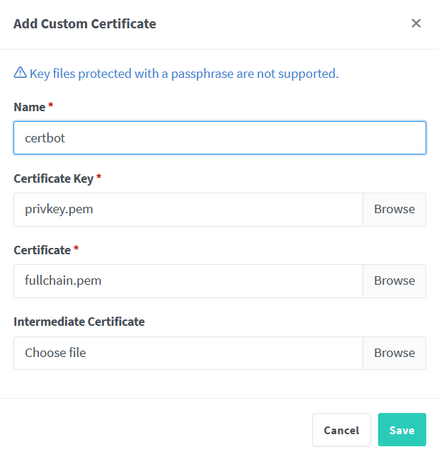
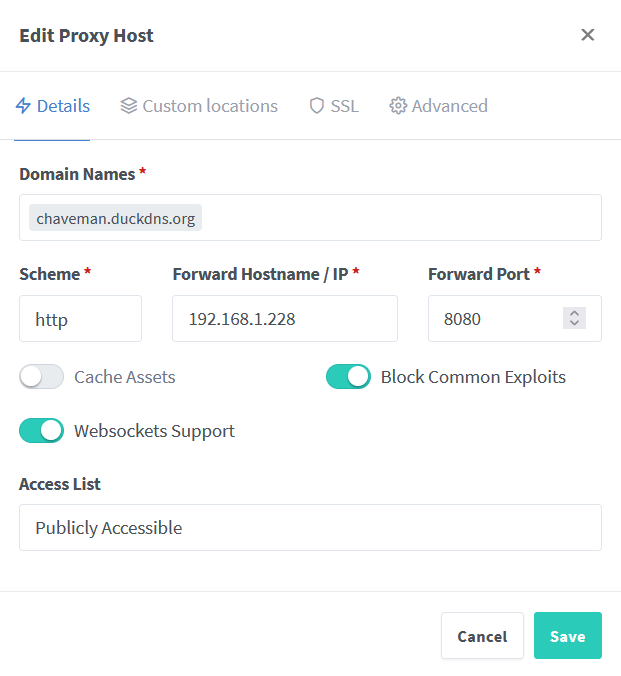
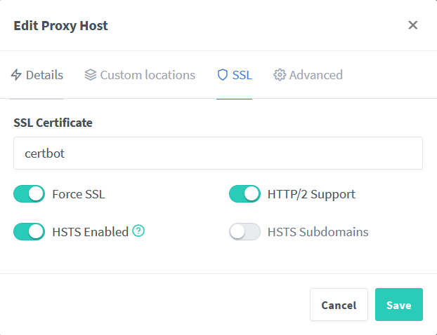
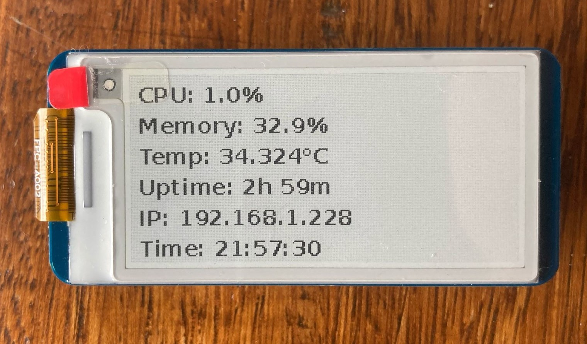

# Auto-hospedagem do Vaultwarden no Raspberry Pi Zero 2  

## Porquê?  

Muitas pessoas utilizam palavras-passe simples ou reutilizadas online porque são mais fáceis de memorizar.Embora eu fizesse o mesmo, percebi que armazenar palavras-passe nos browsers não é de todo seguro nem aconselhável.  

Para melhorar a minha segurança, decidi fazer este projeto de um gestor de palavras-passe caseiro utilizando **Vaultwarden**.  

O Vaultwarden é uma alternativa leve e "auto-hospedada" ao Bitwarden. As funcionalidades são as mesmas, mas é otimizado para dispositivos de baixo consumo como o Raspberry Pi Zero 2W. Além disso, inclui funcionalidades como Autenticação Multi-Fator (MFA), backups, encriptação SSL e acesso remoto, garantindo uma maior segurança enquanto mantenho o controlo total sobre os meus logins. 

Para alcançar este objetivo, utilizei o seguinte **hardware**:  

- **Raspberry Pi Zero 2 W**, compacto e de baixo consumo, ideal para este tipo de aplicações.  
- **Waveshare 2.13 polegadas e-paper HAT v4**  
- **Cartão MicroSD** de 32GB, 16Gb chega mas why not.
- **Leitor de cartões** 
- **PC com Windows**  

## Flashar o Raspberry Pi OS Lite (64 bits)  

O primeiro passo foi flashar o **Raspberry Pi OS Lite (64 bits)** no cartão microSD. Utilizei a ferramenta [Raspberry Pi Imager](https://www.raspberrypi.com/software/) para este efeito.  

1. Inserir o cartão microSD no **leitor de cartões** (obvio).  
2. Abrir o **Raspberry Pi Imager** e selecionar **Choose OS** > **Raspberry Pi OS (Other)** > **Raspberry Pi OS Lite (64-bit)**.  
3. Escolher o cartão microSD como dispositivo de armazenamento.  
4. Clicar em **Next** e depois em **Edit Settings** para configurar:  
   - Ativar **Set hostname**, definir um **nome de utilizador e palavra-passe**, **Configurar Wireless LAN** e ativar **SSH** para permitir o acesso remoto.  

Ao ativar o SSH (secure shell) consigo aceder e controlar remotamente o meu Raspberry Pi a partir de outro dispositivo. Como o Raspberry Pi Zero 2W é frequentemente utilizado sem monitor ou teclado (headless), ter SSH torna-se uma forma conveniente de configurar e gerir o sistema através da rede.  

5. **Guardar** e clicar em **Sim** para utilizar as definições, depois aguardar a gravação.

## Ligar via SSH  

Como ativei o SSH durante a instalação do sistema operativo, posso agora ligar-me ao Raspberry Pi via SSH utilizando o [PuTTY](https://www.putty.org/):  

1. Inserir o cartão microSD no Raspberry Pi e ligá-lo à corrente.  
2. Abrir o **PuTTY** no PC com Windows.  
3. Introduzir o **endereço IP** do Raspberry Pi (obtido via **nmap**) no campo **Host Name (or IP address)**.  
4. Certificar-me de que a **Porta** está definida para `22` e o **Tipo de conexão** é **SSH**.  
5. Clicar em **Open** para iniciar a ligação.  
6. Quando solicitado, introduzir o **nome de utilizador** e a **palavra-passe** definidos na configuração.  

## No terminal  

Para garantir que tudo corre sem problemas, comecei por atualizar e atualizar os pacotes de software:  

```bash
sudo apt update && sudo apt full-upgrade -y
```

### Instalar Docker e Portainer  

1. Instalar o [Docker](https://docs.docker.com/desktop/setup/install/linux/):   ``` curl -sSL https://get.docker.com | sh ```
2. Conceder permissões do Docker ao meu utilizador (joaof):  `` sudo usermod -aG docker joaof ``
3. Reiniciar o sistema para aplicar as alterações: `` sudo reboot ``
4. Obter a versão mais recente do Portainer:  
   `` sudo docker pull portainer/portainer-ce:latest ``
5. Criar e executar um contentor Portainer:  
   ```bash
   sudo docker run -d -p 9000:9000 --restart=always --name=portainer -v /var/run/docker.sock:/var/run/docker.sock -v portainer_data:/data portainer/portainer-ce:latest
   ```
6. Abrir um navegador web e aceder à interface do Portainer em:  
   `` http://192.168.1.228:9000 ``

### Instalar e Configurar o Vaultwarden  

Depois de criar uma conta no Portainer, segui estes passos para instalar e configurar o Vaultwarden no Raspberry Pi.  

1. **Volumes** > **Adicionar Volume**  
2. Criar um volume chamado **VaultwardenServer**  
3. **Contentores** > **Adicionar Contentor** e configurar da seguinte forma:  
   - Nome: Vaultwarden  
   - Imagem: vaultwarden/server:1.32.0 (a versão mais recente não estava a funcionar)
   - Mapear as portas: 8080 no host → 80 no contentor.  
   - **Volumes**: associar o volume criado (**VaultwardenServer**) ao diretório `/data` no contentor.  
   - Política de reinício: **Always**  
   - Dar **Deploy** ao contentor e Após alguns minutos, o Vaultwarden aparece como **Healthy** na interface do Portainer.  

4. Agora já posso aceder à interface web do Vaultwarden em:  
   ``http://192.168.1.228:8080 ``

## Fazer a Reverse Proxy  

Para aceder ao Vaultwarden de forma segura via HTTPS, utilizei um reverse proxy com o amigo [Nginx Proxy Manager](https://nginxproxymanager.com/).  

1. Instalar e iniciar o contentor Nginx Proxy Manager:  
   ```bash
   sudo docker run -d \
     --name=nginx-proxy-manager \
     -p 81:81 \
     -p 80:80 \
     -p 443:443 \
     -v /srv/dev-disk-by-label-Backup/Docker/nginx-proxy-manager/data:/data \
     -v /srv/dev-disk-by-label-Backup/Docker/nginx-proxy-manager/letsencrypt:/etc/letsencrypt \
     --restart unless-stopped \
     jc21/nginx-proxy-manager:latest
   ```
2. Para verificar se o contentor iniciou com sucesso, abri o **Portainer** e confirmei que o contentor `` nginx-proxy-manager `` estava em execução. Outra forma seria executar: ``docker ps -a``. 

    Se o contentor não estivesse a correr, para resolver problemas ver os logs com: ``docker logs nginx-proxy-manager``.

3. Aceder à interface web do **nginx proxy manager** em:  `` http://192.168.1.228:81 ``

### Proteger o Vaultwarden com HTTPS usando DuckDNS e Let's Encrypt


Agora que a reverse proxy está configurada, é preciso garantir o acesso seguro ao Vaultwarden com HTTPS.  
Vou usar o **DuckDNS** para DNS dinâmico e o **Let’s Encrypt** para gerar um certificado SSL gratuito.  

Isto vai me permitir aceder ao Vaultwarden de forma segura a partir de qualquer lugar, sem depender de um IP fixo ou de um domínio pago.  

### Configurar o DuckDNS  
1. Entrei no site [DuckDNS](https://www.duckdns.org/) e criei uma conta grátis.  
2. Adicionei um novo **subdomínio** `chaveman.duckdns.org` e associei-o ao meu **endereço IPv4**.  
3. Copiei o meu **Token do DuckDNS** da página (vou precisar dele mais tarde).  

### Gerar um Certificado SSL usando Let's Encrypt  

1. Usei o **Certbot** com o **Desafio DNS-01** para obter um certificado SSL para o meu domínio DuckDNS.  
Executei o seguinte comando para solicitar um certificado:  
```bash
sudo apt update && sudo apt install certbot -y
sudo certbot certonly --manual --preferred-challenges dns -d chaveman.duckdns.org
```

 2. O Certbot forneceu um **registo TXT** que tem de ser adicionado ao DNS para verificação.
 Utilizando o URL de atualização do DuckDNS:
``https://www.duckdns.org/update?domains=chaveman&token=MEU_TOKEN&txt=VALOR_TXT&verbose=true``
recebi um **OK**, o que significa que o DuckDNS configurou corretamente o meu registo TXT.

3. Para garantir que o registo TXT foi publicado, esperei alguns minutos para a propagação do DNS.
Utilizando o Google Admin Toolbox (Dig), confirmei que o meu valor TXT aparecia na secção ANSWER,
o que significa que estava pronto para prosseguir.

4. Carreguei em **Enter** e o Certbot criou dois ficheiros pem:
    **fullchain.pem** e **privkey.pem** na pasta:
    ``/etc/letsencrypt/live/Vaultwarden.duckdns.org/``

5. Para verificar a validade dos certificados, executei:
    ``sudo certbot certificates`` e verifiquei que os certificados eram válidos por 90 dias, por isso, para renová-los automaticamente, abri o ficheiro de crontab com o comando:
 ``sudo crontab -e``
 Adicionei a seguinte tarefa cron:
``0 0 * * * certbot renew --quiet``
Isto permite que o Certbot renove automaticamente os certificados SSL,
garantindo que a encriptação do site se mantém válida sem necessidade de intervenção manual.

#### Nginx Proxy Manager

Uma vez que o explorador de ficheiros da Web UI apenas mostra ficheiros locais, tive de copiar os ficheiros de certificado do Raspberry Pi para o meu computador para que pudessem ser carregados.

1. Copiar os ficheiros de certificado para o meu computador usando ``scp`` (secure copy):
```bash
  scp joaof@192.168.1.228:/etc/letsencrypt/live/Vaultwarden.duckdns.org/fullchain.pem /home/joaof/Documents/Certificates
  scp joaof@192.168.1.228:/etc/letsencrypt/live/Vaultwarden.duckdns.org/privkey.pem /home/joaof/Documents/Certificates
  ```
2. Voltar à **Web UI do Nginx Proxy Manager** > **SSL Certificates** >
**Add SSL Certificate** > **Custom** e selecionar os ficheiros de certificado:

3. **Adicionar Proxy Host**:

4. Em **SSL**:


Neste momento já deveria ser possível ligar-me a https://chaveman.duckdns.org, mas estava a obter um erro SSL no navegador. Usando o [Port Checker](https://portchecker.co/), percebi que o meu ISP estava a bloquear o tráfego de entrada na porta 443.

5. Aceder às configurações do router para encaminhar a porta 443 para o Raspberry Pi.
6. Finalmente, posso me conectar a https://chaveman.duckdns.org e aceder ao Vaultwarden.

### Melhorar este projeto com um E-Paper Display

1. Ativar SPI no Raspberry Pi executando: ``sudo raspi-config``
2. Navegar até **Interfacing Options** > **SPI** > **Enable**
3. Após ativar o SPI, reiniciar o sistema: ``sudo reboot``
4. Instalar as bibliotecas Python necessárias:
```bash
sudo apt-get update
sudo apt-get install python3-pip python3-pil python3-numpy
sudo apt-get install python3-spidev python3-rpi.gpio
sudo apt-get install python3-psutil
```
5. Clonei o [repositório da waveshareteam](https://github.com/waveshareteam/e-Paper/) e entrei na pasta correta:
```bash
git clone https://github.com/waveshareteam/e-Paper.git
cd ~/e-Paper/RaspberryPi_JetsonNano/python
```
6. Para o meu e-paper Waveshare de 2.13 polegadas v4, utilizei o respectivo módulo **epd2in13_V4** de ``../lib/waveshare_epd`` e testei-o com ``../examples/epd2in13_V4_test.py``.
A partir daí, construí o [system_monitor_v1](system_monitor_v1.txt) para exibir informações do sistema, como temperatura, tempo de atividade e endereço IP.



outra possibilidade seria obter um dominio e cloudflare tunnel

🚧 **Work in Progress** 🚧
